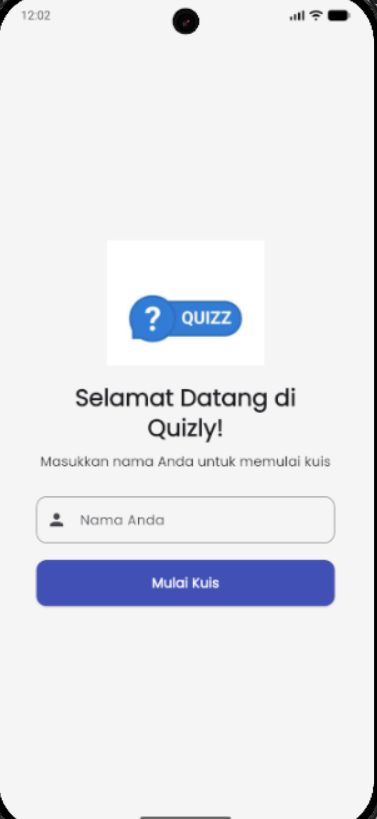
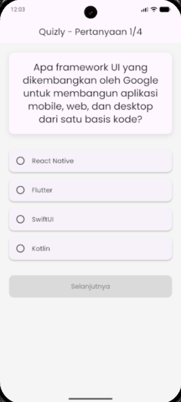
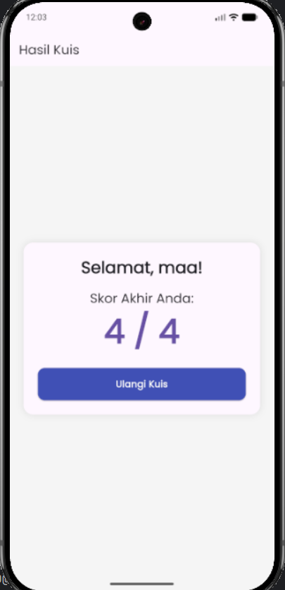

# Quizly

Aplikasi kuis pilihan ganda sederhana yang dibuat dengan Flutter sebagai pemenuhan tugas *take-home*.

## Informasi Mahasiswa

-   **Nama:** Michael Hartadi Ginting
-   **NIM:** 231401122
-   **Lab:** 4

## Tentang Aplikasi (Deskripsi)

**Quizly** adalah aplikasi kuis pilihan ganda di mana pengguna dapat memasukkan nama mereka, menjawab serangkaian pertanyaan (yang dapat mencakup gambar), dan melihat skor akhir mereka. Aplikasi ini dibuat untuk memenuhi kriteria tugas *take-home* dengan fokus pada struktur proyek yang baik, *state management*, dan desain yang responsif.

## Fitur

Aplikasi ini dibuat untuk memenuhi kriteria wajib dan bonus:

* **Alur Pengguna Sederhana:** Terdiri dari 3 halaman utama (Welcome, Quiz, Result).
* **Input Nama Pengguna:** Menyimpan nama pengguna untuk ditampilkan di layar hasil.
* **State Management:** Menggunakan `provider` untuk mengelola state aplikasi (nama pengguna, jawaban, skor) sehingga data tidak hilang saat rotasi layar (Kriteria 7).
* **Struktur Widget:** Menggunakan `StatelessWidget` dan `StatefulWidget` sesuai kebutuhan (Kriteria 1).
* **Widget Reusable:** Komponen UI yang digunakan berulang (seperti `CustomButton` dan `AnswerOption`) dibuat dalam file terpisah (Kriteria 3).
* **Aset & Font Kustom:** Menggunakan aset gambar untuk logo dan soal kuis (Kriteria 4), serta font kustom dari `google_fonts` (Kriteria 5).
* **Desain Dinamis:** Ukuran elemen UI bersifat dinamis menyesuaikan ukuran layar (Kriteria 6).
* **Dual Theme (Bonus):** Mendukung mode Terang (Light) dan Gelap (Dark) secara otomatis menyesuaikan sistem (Bonus 1).
* **Responsive Design (Bonus):** Tampilan beradaptasi untuk ukuran layar yang berbeda, seperti *handphone* dan *tablet* (Bonus 2).
* **Data Lokal:** Pertanyaan disimpan secara lokal sebagai data *dummy* (Kriteria 8).

## Screenshot Aplikasi

**Catatan:** *Ganti gambar-gambar di bawah ini dengan screenshot aplikasi Quizly Anda. Path `docs/` adalah contoh; sesuaikan dengan struktur Anda.*

#### 1. Halaman Welcome (Input Nama)


#### 2. Halaman Kuis (Dengan Gambar)


#### 3. Halaman Skor (Hasil Akhir)


## Struktur Proyek

```
lib/
├── core/
│   ├── app_assets.dart     # Path ke aset
│   └── app_theme.dart      # Tema Light & Dark
├── data/
│   └── dummy_questions.dart # Data dummy pertanyaan
├── models/
│   └── question.dart       # Model data untuk pertanyaan
├── providers/
│   └── quiz_provider.dart  # State management (Provider)
├── screens/
│   ├── quiz_screen.dart    # Halaman kuis
│   ├── result_screen.dart  # Halaman skor
│   └── welcome_screen.dart # Halaman input nama
├── widgets/
│   ├── answer_option.dart  # Reusable widget (pilihan jawaban)
│   └── custom_button.dart  # Reusable widget (tombol)
└── main.dart               # Titik masuk utama dan konfigurasi routing
```